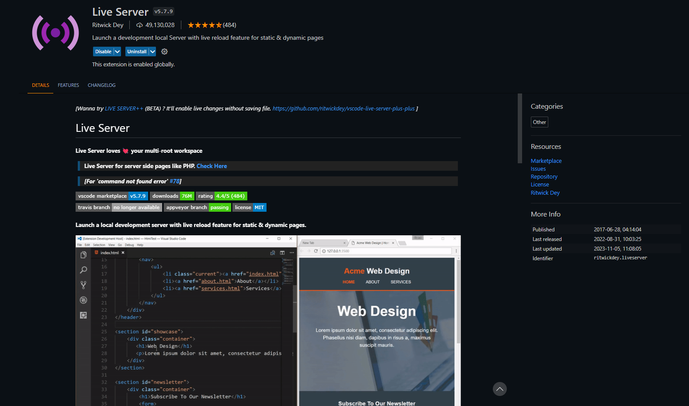
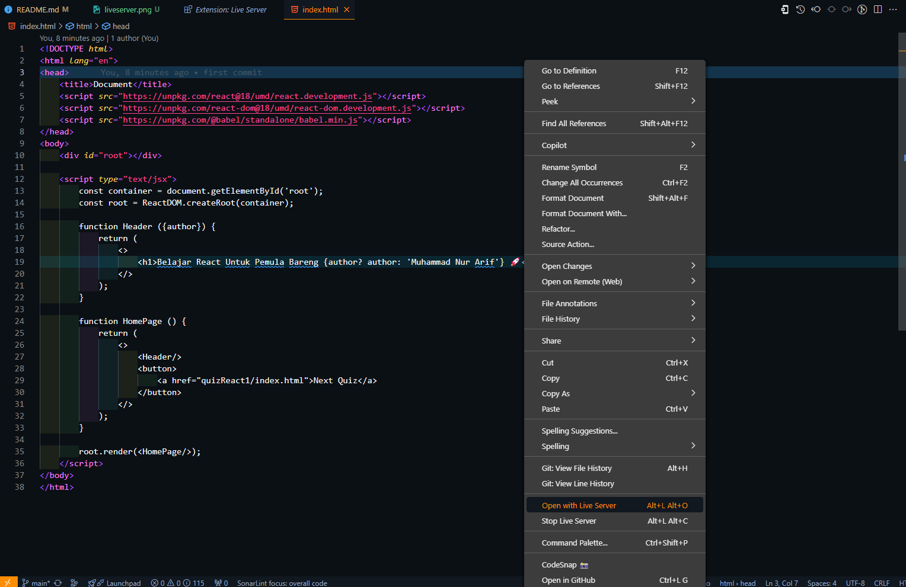

# Learn-React-Basic-For-Beginners

This folder contains various files and folders used for learning React.

## Folder Structure

Here is the folder structure of `Learn-React-Basics-For-Beginners`:

- `index.html`: This is the Home Page view using React DOM with the initial stage.
- `quizReact1`: This folder contains a logic exercise to create a simple counter that contains a file:
    - `index.html`: this file is the question for quiz 1 in the early stages of learning React to create a Simple Counter.
    - `SimpleCounter.html`: this file is an example of a Simple Counter program for illustration as the logic of the quiz.
    - `README.md`: this file contains the documentation of the Simple Counter example program that I created.
- `README.md`: This file contains documentation about the application.

## How to Run the Program

To run this program, follow these steps:

1. Open a terminal type the command `git clone https://github.com/arifsuz/Belajar-React-Dasar-Untuk-Pemula.git`
2. Open the folder `Learning-React-Basics-For-Beginners` with the command `cd Learning-React-Basics-For-Beginners` in the terminal.
3. Then open your code editor and navigate to the folder, if you are using Visua Studi Code just type the command `code .` in the terminal that has done the command in point number 2.

## How to use the program

- It is mandatory to install an extension called <a href="https://marketplace.visualstudio.com/items?itemName=ritwickdey.LiveServer">Live Server</a>

- Open file `index.html` and right-click on your workspace, then click `Open with Live Server`. Or you can use a shortcut by pressing the `ALT+L ALT+O`

## **Authors**
**Developed by :**
**Muhamad Nur Arif**
**(41523010147)**

### **🔗 Link**

